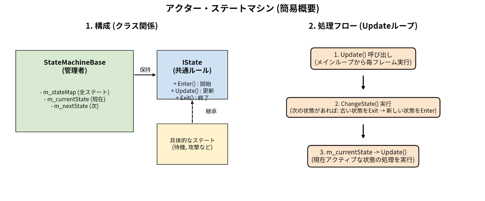

# ゲームプログラマー ポートフォリオ（システム・UI・AI基盤）

---

## 自己紹介

| 項目 | 内容 |
| :--- | :--- |
| **氏名** | 藤谷 尊哉 |
| **学校** | 河原電子ビジネス専門学校 |
| **学科** | ゲームクリエイター科 |
| **メール** | ca01254018@st.kawahara.ac.jp |
| **長所** | ・**正確かつ丁寧な作業:** 見落としがちな細部まで気を配り、不具合の少ない確実な成果物を制作します。 ・**粘り強い探究心:** トラブル時も焦らず冷静に原因を分析し、根本的な解決に至るまで粘り強く取り組みます。 |
| **趣味** | ・**ゲーム:** 『原神』『スプラトゥーン』など。最近は『キングダム ハーツ』にハマっています。 ・**音楽鑑賞・カラオケ:** 米津玄師さんの楽曲が好きで、カラオケでもよく歌います。 ・**吹奏楽:** 元吹奏楽部（トロンボーン担当）。演奏できていませんが、いつか演奏も再開したいです。 ・**映画鑑賞:** アニメ作品が多いですが、サスペンスやドラマ映画なども幅広く観ます。 |

---

## 目次

- [自己紹介](#自己紹介)
- [作品概要](#作品概要)
- [担当ソースコード](#担当ソースコード)
- [技術紹介](#技術紹介)
  - [開発環境を極限まで高める「ホットリロード基盤」](#開発環境を極限まで高めるホットリロード基盤)
  - [MVCアーキテクチャに基づく「UIシステム」](#mvcアーキテクチャに基づくuiシステム)
  - [拡張性とパフォーマンスを両立した「ステートマシン」](#拡張性とパフォーマンスを両立したステートマシン)
  - [3D数学を用いた「物理挙動と地形追従制御」](#3d数学を用いた物理挙動と地形追従制御)
  - [最大100羽を制御する「同心円陣形とソート処理」](#最大100羽を制御する同心円陣形とソート処理)
  - [AIの振動を防ぐ「ヒステリシス移動制御」](#aiの振動を防ぐヒステリシス移動制御)
  - [マネージャーを介した「イベントのオーケストレーション」](#マネージャーを介したイベントのオーケストレーション)
  - [3D数学を用いた「カメラワークとブレンド制御」](#3d数学を用いたカメラワークとブレンド制御)

---

## 作品概要

| 項目 | 内容 |
| :--- | :--- |
| **タイトル** | ぺんたくと |
| **制作人数** | 4人 |
| **製作期間** | 2025年4月～現在 |
| **ゲームジャンル** | 3Dアクション |
| **プレイ人数** | 1 |
| **対応ハード** | PC (Windows 11) / Xbox コントローラー |
| **使用言語** | C++ |
| **エンジン** | BeastEngine（学校内製エンジン（k2EngineLow） / DirectX12） |
| **使用ツール** | Visual Studio 2026 Visual Studio Code Adobe Photoshop 2026 3dsMax 2026 Effekseer GitHub Fork |
| **GitHub URL** | https://github.com/TakebayashiNaoya/ProjectBeast |
| **Youtube URL** | https://youtu.be/daK2kwv6Td4 |

---

## 担当ソースコード

📂 Actor （クリックで展開）

* `Actor.h` / `.cpp`
* `ActorStateMachine.h` / `.cpp`
* `ActorStatus.h` / `.cpp`

📂 Core

* `IMasterParameter.h` / `.cpp`
* `ParameterManager.h` / `.cpp`
* `StateMachineBase.h` / `.cpp`

📂 Character

* `CharacterBase.h` / `.cpp`
* `CharacterParameter.h` / `.cpp`
* `CharacterStateMachine.h` / `.cpp`
* `CharacterStatus.h` / `.cpp`

📂 Penguin

* `PenguinAnimationData.h` / `.cpp`
* `PenguinBase.h` / `.cpp`
* `PenguinIState.h` / `.cpp`
* `PenguinParameter.h` / `.cpp`
* `PenguinStateMachine.h` / `.cpp`
* `PenguinStatus.h` / `.cpp`

📂 ChildPenguin

* `ChildPenguin.h` / `.cpp`
* `ChildPenguinAIController.h` / `.cpp`
* `ChildPenguinManager.h` / `.cpp`
* `ChildPenguinParameter.h` / `.cpp`
* `ChildPenguinStateMachine.h` / `.cpp`
* `ChildPenguinStatus.h` / `.cpp`
* `ChildPenguinTypes.h`
* `ClumsyChildPenguinIState.h` / `.cpp`
* `ClumsyChildPenguinStateMachine.h` / `.cpp`

📂 DaddyPenguin

* `DaddyPenguin.h` / `.cpp`
* `DaddyPenguinController.h` / `.cpp`
* `DaddyPenguinIState.h` / `.cpp`
* `DaddyPenguinParameter.h` / `.cpp`
* `DaddyPenguinStateMachine.h` / `.cpp`
* `DaddyPenguinStatus.h` / `.cpp`

📂 Camera

* `CameraCommon.h` / `.cpp`
* `CameraController.h` / `.cpp`
* `CameraManager.h` / `.cpp`
* `CameraSteering.h` / `.cpp`

📂 Stage

* `IStage.h` / `.cpp`
* `StageSystem.h` / `.cpp`

📂 CPReaction

* `CPReactionAnimStatus.h` / `.cpp`
* `CPReactionMenu.h` / `.cpp`
* `CPReactionSystem.h` / `.cpp`
* `CPReactionStatus.h` / `.cpp`
* `MasterCPReactionParameter.h` / `.cpp`

📂 InGameStartingAnimLogic

* `InGameStartingAnimLogic.h` / `.cpp`

📂 System

* `SystemPacket.h` / `.cpp`

📂 WpWarning

* `MasterWpWarningParameter.h` / `.cpp`
* `WpWarningAnimStatus.h` / `.cpp`
* `WpWarningMenu.h` / `.cpp`
* `WpWarningStatus.h` / `.cpp`
* `WpWarningSystem.h` / `.cpp`

📂 Util

* `JsonConverter.h` / `.cpp`

---

## 技術紹介

### 開発環境を極限まで高める「ホットリロード基盤」

ゲーム内の各種数値をC++コードから分離し、ゲームを実行したままリアルタイムに変更を反映させるプランナー向けのデバッグ環境を構築しました。

* **JSONパースと更新監視**: `JsonConverter` クラスにより読み取り処理を簡略化。ファイルの更新日時を監視し、即座に変更を反映するホットリロードを実現しました。
* **ランダム個体値の保護機構**: ホットリロード時にキャラクターの個体値が初期化されるバグを防ぐため、`ParameterManager` にロックフラグを実装。デバッグの利便性とゲーム仕様を両立しました。

---

### MVCアーキテクチャに基づく「UIシステム」

危険エリアへの警告（WpWarning）や、子ペンギンの感情表現（CPReaction）など、多数のUIを効率的に管理するシステムを構築しました。

* **コンポーネント分離による拡張性**: 描画（Layout）とロジック（Menu）をセットで扱う `StagePacket` を設計。機能追加時に既存のコードを汚さないクリーンな設計を徹底しました。
* **動的生成時のメモリリーク防止**: 頻繁に生成・破棄されるUIレイアウトのポインタを `m_layouts` コンテナで一元管理し、長時間のプレイでも安全な設計にしています。

---

### 拡張性とパフォーマンスを両立した「ステートマシン」

100羽の群衆AIを安定して制御するため、ポリモーフィズム（多態性）を活用した状態遷移システムを構築しました。

* **Template MethodパターンによるAI連携**: 各性格の固有アクションを仮想関数で分離。「おっちょこちょいが転倒」→「世話焼きが検知して救助」という、マネージャーを介した疎結合な連携を実現しました。
* **複雑なギミックの回転制御**: 「渦潮」ギミックにおいて、ステートマシン内で拡大・縮小の両方のフェーズ中に適切な回転処理（Rotation）を継続させ、破綻のない挙動を担保しています。

* **なぜステートマシンを実装したのか**:
アクションゲームでは開発の進行に伴い新しい状態が次々と追加されます。ステートマシンを用いて状態ごとにクラスを独立させることで、既存のコードに影響を与えずに新機能を素早く追加できる「高い拡張性」と、パラメーター調整時に該当クラスだけを見れば済む「高い保守性」を確保し、開発のイテレーション（反復）速度を向上させました。

---

### 3D数学を用いた「物理挙動と地形追従制御」

可変フレームレート環境下での動作安定性と、群衆AIを処理落ちさせないための最適化を追求しました。

* **計算負荷を極小化する `LengthSq()`**: 100羽のペンギンの距離計算やゼロ判定において、重い平方根計算を排除し「距離の二乗」で比較処理を徹底。致命的な処理落ちを防ぎました。
* **クォータニオンとSlerpを用いた地形追従**: 斜面を滑る際、物理計算はそのままに「描画姿勢のみ」を地形法線に合わせて回転。`Quaternion::Multiply` と `Slerp` を使い、滑らかに吸い付くビジュアルを実現しました。

---

### 最大100羽を制御する「同心円陣形とソート処理」

親ペンギンに追従する子ペンギンの隊列において、数学とアルゴリズムを用いて整然とした美しい陣形を構築しました。

* **三角関数を用いた同心円配置**: 階層ごとの半径と円周を計算し、`sin` と `cos` を用いて重なり合わない綺麗な同心円状の目標座標（最大100個）を動的に生成しています。
* **`std::stable_sort` を活用した優先配置**: 「甘えん坊タイプは内側に配置する」という要件に対し、他のペンギンの「隊列参加順」を崩さない安定ソートを採用し、自然な隊列形成を実現しました。

---

### AIの振動を防ぐ「ヒステリシス移動制御」

AIが目標地点へ向かう際、「滑り・走り・歩き・停止」を距離に応じて自動かつ自然に切り替える移動システムを実装しました。

* **ヒステリシスによるチャタリング防止**: 状態が切り替わる境界で「走る」と「歩く」を繰り返す不自然な振動を防ぐため、切り替え閾値に遊び（バッファ）を設け、挙動を劇的に安定させました。
* **距離に応じたシームレスなブレーキ**: 目標地点での急停止を防ぐため、停止距離の2倍の範囲内に入ると、距離に比例して速度倍率（`speedMultiplier`）を滑らかに減衰させるブレーキロジックを組み込んでいます。

---

### マネージャーを介した「イベントのオーケストレーション」

「親がかまくらに入ると、子も呼ばれて中に入る」という複雑な連携を、クラスの結合度を下げる（疎結合）設計で実現しました。

* **役割を分担したイベント発火**: 親はマネージャーへ「入り口の座標」のみを伝達。報告を受けたマネージャーが条件を満たす子ペンギンを抽出し、AIにイベントフラグを立てます。
* **AIの自律的なイベント解決**: フラグを受けたAIは通常の追従を中断して自律的に入り口へ移動。極座標計算を用いてかまくら内部のランダムな座標へ自身をワープさせるなど、保守性の高いイベント駆動を実装しました。

---

### 3D数学を用いた「カメラワークとブレンド制御」

プレイヤーの操作性や臨場感を高めるため、複数のカメラ状態を滑らかに補間する管理システムと、3D数学を駆使した自律的な周回カメラを構築しました。

* **`Lerp` を用いたシームレスなカメラ遷移**: 複数のカメラコントローラーをマネージャーで一元管理。切り替え時に `CameraData::Lerp` による線形補間を施し、指定時間で滑らかにブレンドする遷移基盤を実装しました。
* **外積と三平方の定理による角度制限**: 右スティックによる旋回制御において、外積から正確な右方向ベクトルを算出して回転。上下の角度制限（クランプ）時には、三平方の定理を用いてXZ平面の長さを逆算・補正することで、ターゲットとの距離を完全に一定に保つ堅牢な数学処理を実装しました。
